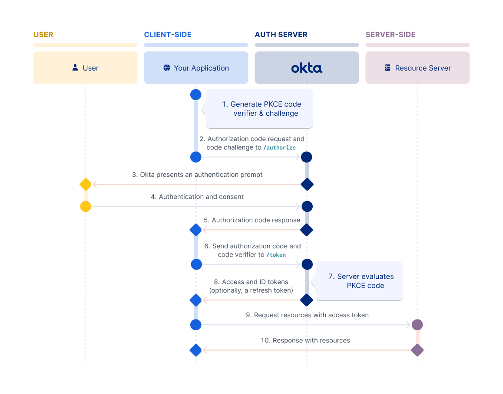
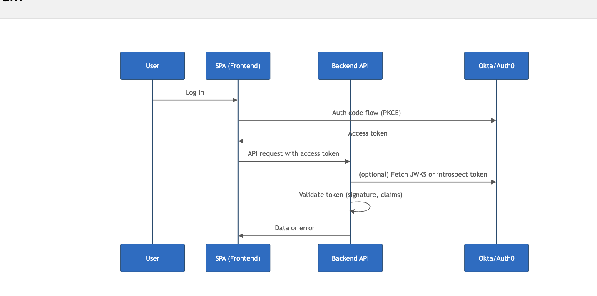

- oauth - Controls and delegate authorization resource to protected resource
- OIDC - Extends oauth 2 by enabling to retrive info about end users

### OAuth 2.0
#### Terms
- client : App that wants to access some data
- resource server : App that store the data that client wants
- resource owner : Owner of data on resource server. ex- end user
- authorization server : server that manages access and issues access tokens ex: okta
- Oauth 2.0 grant : Authorization given to the cleint by the user. ex : authorization code and client credentials
- access token : token issues by the authorization server in exchange of grant
- refresh token: optional token exchanged for new access token if access token expired

#### Oauth 2.0 FLow
- client request authorization from the resource owner 
- if owner gives authorization, client passes authorization grant to the authorisation server
- If grant is valid, authorization server returns an access token, possibly also refresh token and id token
- cleint now uses the access token to access the resource server

### OpenID Connect
- It is and authentication standard built on top of oauth 2.0
- It defines an ID token type to pair with access token and refresh token

#### Terms
- OpenID Provide : Authorisation server that issues the ID token. ex; OKTA
- End User: end user info that is contained in the ID token
- relying party: client app that requests ID token from OKTA
- ID token : token issued by the openid provider that contains information about end user in form of claims
- claim: piece of information about user

### Authorization code flow with PKCE flow

### AI generated flow

